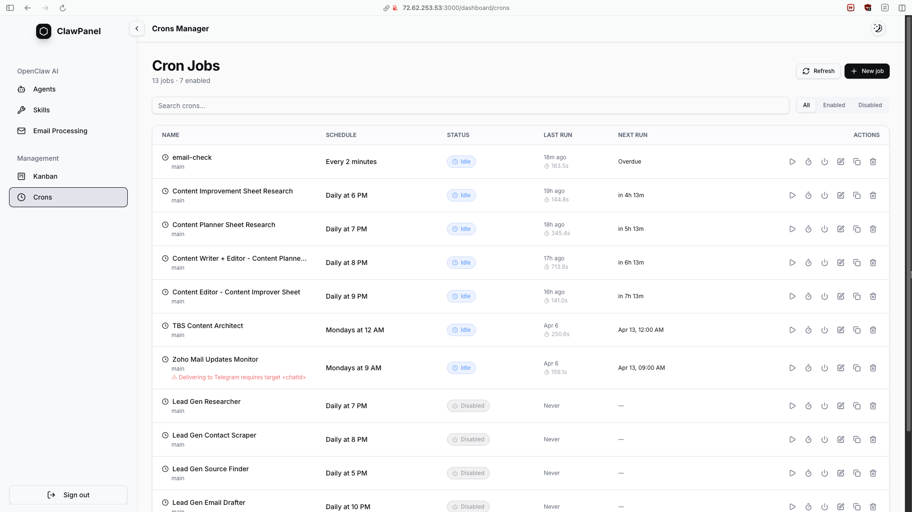

# ClawPanel


ClawPanel is a comprehensive web dashboard and control center for managing **OpenClaw AI** instances. Unlike standard cloud-based panels, ClawPanel runs entirely locally (or on your VPS) to hook directly into your OpenClaw filesystem and CLI interfaces, offering zero-latency monitoring, configuration, and project administration.

## ⚡ Features

ClawPanel is built as a complete interface over the openclaw daemon architecture, bringing terminal-based features directly to a graphical UI:

* **Agents Manager**: View all registered OpenClaw personas. Read and edit core workspace instructions (like `AGENTS.md`, `SOUL.md`) seamlessly thanks to our pre-cached preview-first editing environment.
* **Channels Monitoring**: Perform live network health checks for your running agents across platforms (Telegram, Discord, User APIs, etc.).
* **Skills Explorer**: Interface directly with OpenClaw's CLI plugin registry. Enable/disable default skills or explore external skill implementations securely from your own VPS.
* **Cron Jobs Management**: Visual oversight of background chronologically-scheduled operations spanning the active agents.
* **Kanban Project Tracker**: An integrated project management suite to overview ongoing AI workloads ranging from 'Review' queues to fully 'Completed' multi-agent automation runs. 
* **Email Automation**: Monitor local email processing and queue integration logic without maintaining separate dedicated webhooks.

## 🛠 Tech Stack

- **Framework**: Next.js 15 (App Router)
- **Styling**: Tailwind CSS + `lucide-react`
- **Architecture**: CLI & Filesystem-First design
  - File management endpoints interact directly with `openclaw` via child process invocations (e.g., `openclaw agents list --json`) avoiding unreliable WebSockets.
- **Authentication**: Firebase Client/Admin Auth

## 🔧 Environment Variables

On your primary device or VPS, ClawPanel relies on several environment configs to properly link to the OpenClaw environment. 

You must define a `.env.local` file at the root of the project:

```env
# Path to the active openclaw global or system binary
OPENCLAW_BIN=openclaw

# Fallback path to the primary agent's workspace directory
WORKSPACE_PATH=/home/clawdbot/clawd

# Client-Side Firebase configuration
NEXT_PUBLIC_FIREBASE_API_KEY=your_api_key
NEXT_PUBLIC_FIREBASE_AUTH_DOMAIN=your_project.firebaseapp.com
NEXT_PUBLIC_FIREBASE_PROJECT_ID=your_project_id
NEXT_PUBLIC_FIREBASE_STORAGE_BUCKET=your_bucket
NEXT_PUBLIC_FIREBASE_MESSAGING_SENDER_ID=your_sender_id
NEXT_PUBLIC_FIREBASE_APP_ID=your_app_id
```

## 🚀 Getting Started

To get started with local development or deploying:

1. Clone and install dependencies:
   ```bash
   npm install
   ```

2. Run the automated configuration setup wizard to link ClawPanel to your `openclaw` installation path and active workspace:
   ```bash
   npm run setup
   ```

3. Start the development server:
   ```bash
   npm run dev
   ```

> **Note:** Development features requiring the `openclaw` CLI will expect `openclaw` to be globally installed (`npm i -g openclaw@latest`) and authenticated on the same machine.

## 📦 Production Deployment

ClawPanel is designed to be built and run on the same VPS environment that typically runs the `openclaw` gateway process. 

To deploy:

1. Build the optimal production payload:
```bash
npm run build
```

2. Run utilizing `pm2` for process persistence:
```bash
pm2 start npm --name "clawpanel" -- run start
```
